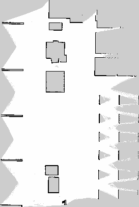

# My Bot - ROS 2 Package



`my_bot` is a ROS 2 package designed for simulating and visualizing a mobile robot with various sensors in a virtual environment using Gazebo and RViz. It includes support for camera, IMU, depth sensing, and custom control plugins.

## 📁 Project Structure

```
my_bot/
├── config/                 # Configuration files for RViz, mapping, controllers, etc.
├── description/           # Robot model defined using XACRO files
├── launch/                # (if exists) Launch files for simulation and visualization
├── meshes/                # (if exists) 3D models for the robot
├── worlds/                # (if exists) Custom Gazebo world files
├── CMakeLists.txt         # Build configuration
├── package.xml            # ROS 2 package metadata
├── map.png                # Visualization of the map or environment
└── README.md              # Project documentation
```

## 🚀 Features

- URDF/XACRO-based modular robot description
- Configurable IMU, camera, and depth camera
- Controller configuration using ROS 2 Control
- RViz visualization files for various perspectives
- Support for SLAM and mapping with predefined maps

## 🛠 Requirements

- ROS 2 Humble or newer
- Gazebo (Fortress, Garden, or compatible)
- RViz 2
- `ros2_control`, `joint_state_broadcaster`, `robot_state_publisher`, and other common packages

## 🧪 Quick Start

1. **Clone the repository:**

```bash
git clone https://github.com/Sumitb09/my_bot.git
cd my_bot
```

2. **Build the package:**

```bash
colcon build --packages-select my_bot
source install/setup.bash
```

3. **Launch the robot in RViz or Gazebo:**

```bash
# Example (add actual launch file names if available)
ros2 launch my_bot view_bot.launch.py
```

## 🧩 Configuration

### RViz Files

- `drive_bot.rviz`, `view_bot.rviz`, and `map.rviz` provide different perspectives and configurations for visualization.

### Maps

- The `config/` directory includes SLAM/AMCL-compatible map and posegraph files (e.g., `factory_map_serial.yaml`, `.pgm`).

## 🧱 Robot Components

- **Camera:** `camera.xacro`
- **IMU:** `imu.xacro`
- **Depth Sensor:** `depth_camera.xacro`
- **Control Systems:** Includes `control.xacro` and `gazebo_control.xacro` for interfacing with Gazebo plugins.

## 📷 Visualization

You can use RViz to visualize different aspects of the robot like sensors, joints, and mapping data:

```bash
rviz2 -d config/view_bot.rviz
```

## 📄 License

[MIT License](LICENSE) – free to use and modify.

## 🤝 Contributing

Feel free to fork this repository and submit a pull request. Contributions are welcome!
